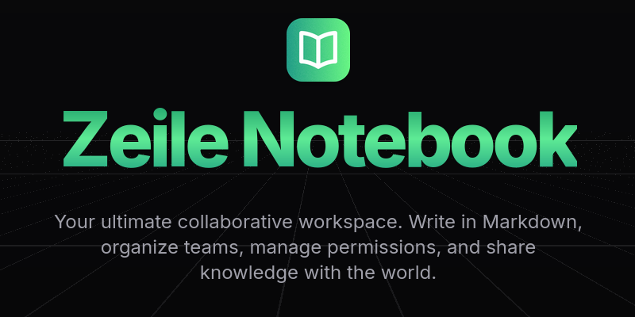
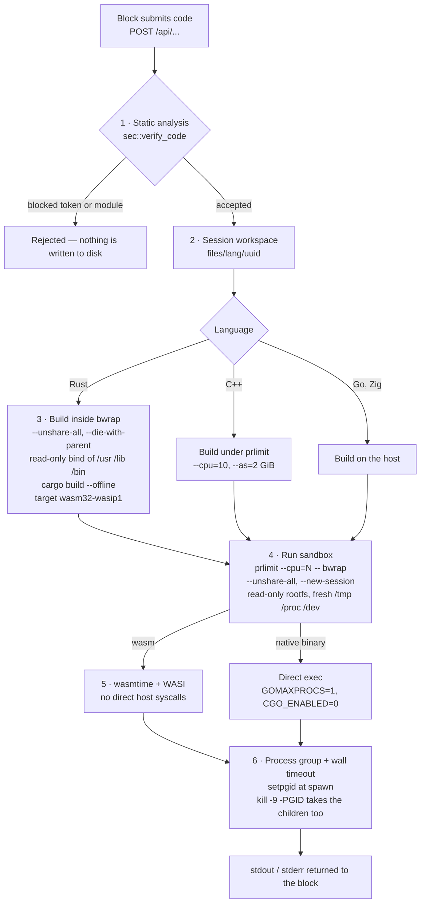

# Zeile Notebook



Zeile Notebook is a block-based platform for developers, educators, and students. It enables the creation of interactive notebooks that blend Markdown documentation, user interfaces, and native code execution (such as Rust and Go) within an isolated remote environment.

Whether prototyping an API, teaching a programming language, or documenting architectures, Zeile provides an isolated and collaborative workspace.

## Key Features

* **Interactive Blocks:** Combined use of Markdown text and executable code on the same page.
* **Privacy by Default:** User code and notes are not used for Artificial Intelligence model training.
* **Collaboration and Forking:** Option to make notebooks public or clone (fork) notebooks from other users into your own environment.
* **Shortcuts:** Keyboard-based navigation for structured block editing.

## Security Architecture

Executing third-party code on the server utilizes isolation layers to maintain stability and protect the system against abuse (such as DoS, cryptocurrency mining, or unauthorized access):

1. **Static Analysis (AST/Regex):** Prior to compilation, the code is scanned to block compiler directives (e.g., `//go:generate`) and system imports (e.g., `include!` macros in Rust or `os/exec` subpackages in Go).
2. **Container Isolation (Bubblewrap/Bwrap):** The compilation process and execution occur within a restricted environment.
   * *Network Namespace:* Removal of network access (`--unshare-all`) to prevent external connections.
   * *Filesystem Read-Only:* The base filesystem is mounted in read-only mode. The process only accesses a temporary virtual directory.
3. **WebAssembly (WASI):** Rust code is compiled to Wasm and executed through the `wasmtime` engine, restricting direct access to the host architecture.
4. **Kernel Limits (prlimit):** Processes have defined limits for CPU usage and thread count to mitigate resource exhaustion.
5. **Process Management:** Use of *Process Groups* (PGID) with defined timeouts to terminate infinite loop processes and their respective child threads.
6. **Session Isolation:** Compilation workspaces are generated and mapped via UUID, preventing file collision between users sharing the same network.

### The path of a submission

Every block execution walks the same pipeline. Compilation and execution are separate stages
with separate protections, and the isolation of the execution stage is identical for every
language:



| Layer | Mechanism | What it is there for | Where |
|---|---|---|---|
| 1 | token and module blocklist, `#![forbid(unsafe_code)]` prepended to Rust | stop the obvious before spending CPU on it | `src/sec/mod.rs` |
| 2 | workspace named by session UUID | one submission cannot read or overwrite another's files | `src/executor/mod.rs` |
| 3 | `bwrap` around the build | the compiler itself runs code (build scripts, macros) — for Rust that happens with no network and a read-only rootfs | `src/executor/mod.rs` |
| 4 | `prlimit` + `bwrap` around the run | CPU ceiling, no network, no writable host filesystem | `src/file/mod.rs` |
| 5 | `wasmtime` running WASI | Rust never becomes a native host binary | `src/file/mod.rs` |
| 6 | `setpgid` + wall-clock timeout + `kill -9 -PGID` | an infinite loop, or a process that forks children, still dies | `src/file/mod.rs` |

Judge and challenge submissions additionally pass through a semaphore (`JUDGE_CONCURRENCY`,
default 2), so a burst of submissions cannot take the whole machine.

No single layer here is trusted on its own — the blocklist of layer 1 is a filter, not a proof,
and it exists to make layers 3 to 6 cheaper, not to replace them.

## Architecture

Two applications live in this repository:

| | Stack | Where |
|---|---|---|
| **Frontend** | Next.js 16 (App Router) · React 19 · next-intl (pt-br/en) · fumadocs | repository root |
| **Backend** | Axum · Diesel-async · PostgreSQL · Automerge (CRDT) · WebSocket | `rust-server/` |

The backend owns authentication, notebooks, teams, realtime sync and code execution. The
desktop build (`src-tauri/`) wraps both processes and runs them bound to loopback. Generated
OpenAPI docs are served by the backend at `/docs`.

## Local Development

**Requirements:** Node 22 · pnpm 11.10 · Rust stable (edition 2024) · PostgreSQL 16.

```bash
# frontend — from the repository root
cp env.example .env.local        # then fill in the values
pnpm install
pnpm dev                         # http://localhost:3000

# backend — from rust-server/
cp .env.example .env             # DATABASE_URL and JWT_SECRET are required
diesel setup                     # applies the migrations
cargo run                        # http://localhost:3099, Swagger UI at /docs
```

Other useful commands: `pnpm lint` (Biome), `pnpm types:check`, `pnpm test` (Vitest) and, in
`rust-server/`, `cargo test`.

### Before self-hosting

Zeile **compiles and runs code submitted by its users** on the machine hosting the backend.
That is the product, not an accident — but it means an exposed instance is an execution target.
Read the isolation layers above, install `bwrap`, `prlimit` and `wasmtime` on the host (code
execution is spawned through them and fails without them), and set `CORS_ALLOWED_ORIGINS`,
`JWT_SECRET` and `BIND_ADDR` explicitly in every deployment. The defaults are meant for local
development.

## Terms and Privacy

The system complies with data protection standards and collects only the data necessary for authentication and logging.
* No inserted data is sold or used to train third-party Artificial Intelligence models.
* Use of the infrastructure for malware, DDoS, or mining will result in account suspension and deletion of linked data.
* Refer to the full [Privacy Policy](/docs/privacy) and [Terms of Use](/docs/terms).

## License

Zeile Notebook is released under the [MIT License](LICENSE). You are free to use, modify and
distribute it, including commercially, as long as the copyright notice is kept.

The license covers the source code. The **Zeile** name and logo are not licensed with it — a
fork is welcome, calling it Zeile is not.

## Contributing

Issues and pull requests go to [HadsonRamalho/zeile-notebook](https://github.com/HadsonRamalho/zeile-notebook).
Pull requests follow the template in `.github/pull_request_template.md`; the code conventions
that apply in review are the ones in `docs/padroes.md`.
