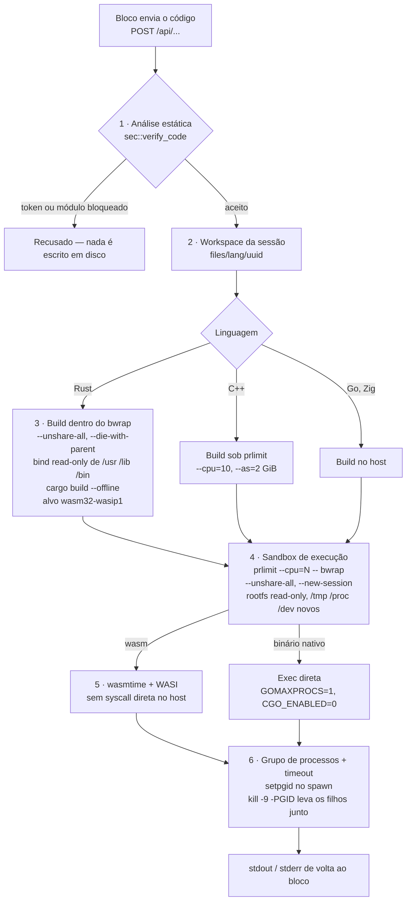

# Zeile Notebook


O Zeile Notebook é uma plataforma baseada em blocos para desenvolvedores, professores e estudantes. Ele permite a criação de cadernos interativos que mesclam documentação em Markdown, interfaces e execução de código nativo (como Rust e Go) em um ambiente remoto isolado.

Seja para prototipar uma API, ensinar uma linguagem de programação ou documentar arquiteturas, o Zeile oferece um ambiente isolado e colaborativo.

## Principais Funcionalidades

* **Blocos Interativos:** Uso conjunto de texto em Markdown e código executável na mesma página.
* **Privacidade por Padrão:** O código e as anotações do usuário não são utilizados para treinamento de modelos de Inteligência Artificial.
* **Colaboração e Forking:** Opção de tornar cadernos públicos ou realizar clones (forks) de cadernos de outros usuários para o seu ambiente.
* **Atalhos:** Navegação baseada em teclado para edição estruturada dos blocos.

## Arquitetura de Segurança

A execução de código de terceiros no servidor utiliza camadas de isolamento para manter a estabilidade e proteger o sistema contra abusos (como DoS, mineração de criptomoedas ou acessos indevidos):

1. **Análise Estática (AST/Regex):** Antes da compilação, o código é verificado para bloquear diretivas de compilador (ex: `//go:generate`) e importações de sistema (ex: macros `include!` no Rust ou subpacotes `os/exec` no Go).
2. **Isolamento de Contêiner (Bubblewrap/Bwrap):** O processo de compilação e a execução ocorrem dentro de um ambiente restrito.
   * *Network Namespace:* Remoção do acesso à rede (`--unshare-all`) para evitar conexões externas.
   * *Filesystem Read-Only:* O sistema de arquivos base é montado em modo leitura. O processo acessa apenas um diretório virtual temporário.
3. **WebAssembly (WASI):** O código Rust é compilado para Wasm e executado através do motor `wasmtime`, restringindo o acesso direto à arquitetura do host.
4. **Limites do Kernel (prlimit):** Processos possuem limites definidos de uso de CPU e número de threads para mitigar a exaustão de recursos.
5. **Gerenciamento de Processos:** Uso de *Process Groups* (PGID) com *timeouts* definidos para encerrar processos em loop infinito e suas respectivas threads filhas.
6. **Isolamento de Sessão:** Os espaços de trabalho (workspaces) de compilação são gerados e mapeados via UUID, prevenindo a colisão de arquivos entre usuários que compartilham a mesma rede.

### O caminho de uma submissão

Toda execução de bloco percorre o mesmo pipeline. Compilação e execução são etapas separadas,
com proteções separadas, e o isolamento da etapa de execução é idêntico para todas as
linguagens:



| Camada | Mecanismo | Para que serve | Onde |
|---|---|---|---|
| 1 | blocklist de tokens e módulos, `#![forbid(unsafe_code)]` prefixado ao Rust | barrar o óbvio antes de gastar CPU com ele | `src/sec/mod.rs` |
| 2 | workspace nomeado pelo UUID da sessão | uma submissão não lê nem sobrescreve o arquivo de outra | `src/executor/mod.rs` |
| 3 | `bwrap` em volta do build | o próprio compilador executa código (build scripts, macros) — no Rust isso acontece sem rede e com rootfs read-only | `src/executor/mod.rs` |
| 4 | `prlimit` + `bwrap` em volta da execução | teto de CPU, sem rede, sem sistema de arquivos do host gravável | `src/file/mod.rs` |
| 5 | `wasmtime` executando WASI | o Rust nunca vira binário nativo no host | `src/file/mod.rs` |
| 6 | `setpgid` + timeout de parede + `kill -9 -PGID` | loop infinito, ou processo que gera filhos, morre mesmo assim | `src/file/mod.rs` |

Submissões de juiz e de desafio passam ainda por um semáforo (`JUDGE_CONCURRENCY`, padrão 2),
para que uma rajada de submissões não tome a máquina inteira.

Nenhuma camada aqui é confiável sozinha — a blocklist da camada 1 é um filtro, não uma prova, e
existe para tornar as camadas 3 a 6 mais baratas, não para substituí-las.

## Arquitetura

Duas aplicações moram neste repositório:

| | Stack | Onde |
|---|---|---|
| **Frontend** | Next.js 16 (App Router) · React 19 · next-intl (pt-br/en) · fumadocs | raiz do repositório |
| **Backend** | Axum · Diesel-async · PostgreSQL · Automerge (CRDT) · WebSocket | `rust-server/` |

O backend é dono da autenticação, dos cadernos, dos times, do sync em tempo real e da execução
de código. A build desktop (`src-tauri/`) embrulha os dois processos e os sobe presos ao
loopback. A documentação OpenAPI gerada é servida pelo backend em `/docs`.

## Como rodar localmente

**Requisitos:** Node 22 · pnpm 11.10 · Rust stable (edition 2024) · PostgreSQL 16.

```bash
# frontend — a partir da raiz do repositório
cp env.example .env.local        # depois preencha os valores
pnpm install
pnpm dev                         # http://localhost:3000

# backend — a partir de rust-server/
cp .env.example .env             # DATABASE_URL e JWT_SECRET são obrigatórias
diesel setup                     # aplica as migrations
cargo run                        # http://localhost:3099, Swagger UI em /docs
```

Outros comandos úteis: `pnpm lint` (Biome), `pnpm types:check`, `pnpm test` (Vitest) e, em
`rust-server/`, `cargo test`.

### Antes de auto-hospedar

O Zeile **compila e executa código enviado pelos seus usuários** na máquina que hospeda o
backend. Isso é o produto, não um acidente — mas significa que uma instância exposta é um alvo
de execução. Leia as camadas de isolamento acima, instale `bwrap`, `prlimit` e `wasmtime` no
host (a execução de código é lançada através deles e falha sem eles), e defina
`CORS_ALLOWED_ORIGINS`, `JWT_SECRET` e `BIND_ADDR` explicitamente em todo ambiente. Os padrões
são feitos para desenvolvimento local.

## Termos e Privacidade

O sistema está em conformidade com a LGPD e coleta apenas os dados necessários para autenticação e geração de logs.
* Nenhum dado inserido é vendido ou utilizado para treinar modelos de Inteligência Artificial de terceiros.
* O uso da infraestrutura para malwares, DDoS ou mineração resultará em suspensão da conta e exclusão dos dados vinculados.
* Consulte a [Política de Privacidade](/docs/privacy) e os [Termos de Uso](/docs/terms) completos.

## Licença

O Zeile Notebook é distribuído sob a [Licença MIT](LICENSE). Você pode usar, modificar e
distribuir, inclusive comercialmente, desde que o aviso de copyright seja mantido.

A licença cobre o código-fonte. O nome e o logo **Zeile** não vão junto — um fork é bem-vindo,
chamá-lo de Zeile não é.

## Contribuindo

Issues e pull requests vão para [HadsonRamalho/zeile-notebook](https://github.com/HadsonRamalho/zeile-notebook).
Pull requests seguem o template em `.github/pull_request_template.md`; as convenções de código
válidas em review são as de `docs/padroes.md`.
